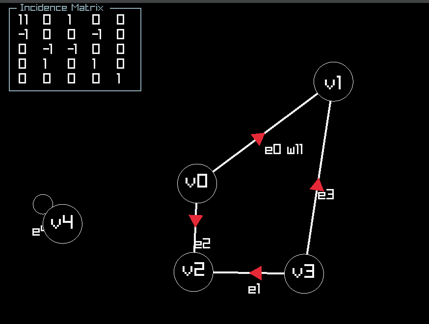
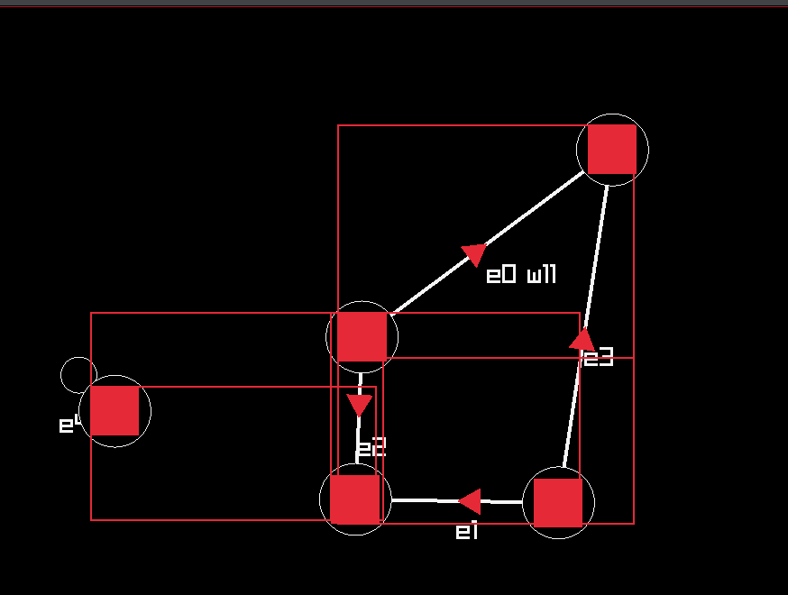
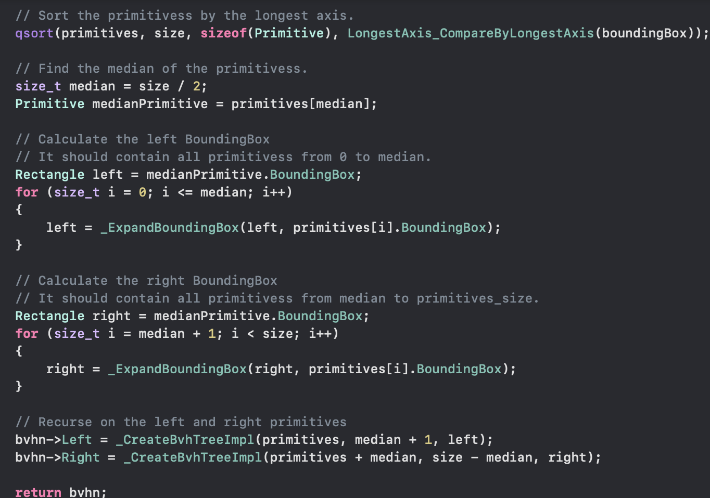
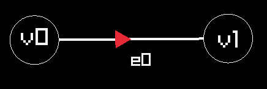
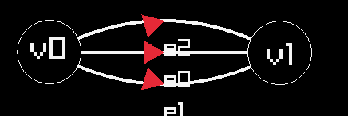
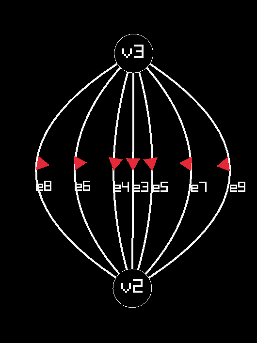

# Graph Theorist Sketchpad

Created for WSU MATH 453 Graph Theory. Made entirely with C in Raylib and Raygui.

https://github.com/bens-schreiber/Graph-Theorist-Sketchpad/assets/64621941/59364901-7b7c-439c-ab47-8393c14f299d

The following is the write-up required for the project submission:

## Introduction

The Graph Theorist Sketchpad is a program that allows users to create, manipulate, and analyze graphs. The program was created using the C Programming language, along with Raylib, a C wrapper for OpenGL, and RayGUI, an auxiliary library for Raylib that provides a set of GUI elements. The program was created as a final project for Math 453: Graph Theory at Washington State University. Because I chose to create the program in C, the entire project is full of my own implementations of common data structures and algorithms, from collision detection to unit testing.

## Features

1. Create Vertices

   - Users can create vertices by entering "Vertex Creation Mode" and clicking anywhere on the screen away from the bounds of existing vertices and the GUI.

2. Create Edges

   - Users can create edges by entering "Edge Creation Mode" and clicking on two vertices. The program will automatically create an edge between the two vertices.

3. Parallel Edges

   - Users can create parallel edges by going through the same process as create edges. This edge will be created using a Bezier curve, which is moved away from all other edges to prevent overlap.

4. Move Vertices

   - Users can move vertices by entering "Vertex Move Mode" and dragging the vertex to a new location. All edges connected to the vertex will move with it.

5. Self Loops

   - Users can create self loops by entering "Edge Creation Mode" and clicking on the same vertex twice.

6. Directed Edges

   - Users can create directed edges by entering "Edge Creation Mode". The program will automatically create a directed edge from the first vertex to the second vertex.

7. Label Vertices

   - All vertices are labeled with a unique number. Users can toggle the visibility of these labels.

8. Label Edges

   - All edges are labeled with a unique number. Users can toggle the visibility of these labels.

9. View Edge count

   - Users can see the amount of edges in the graph at the top of the screen.

10. View Vertex count

    - Users can see the amount of vertices in the graph at the top of the screen.

11. Create Weighted Edges

    - Users can create weighted edges by entering "Edge Creation Mode" and entering a weight in the GUI. All edges are labeled with their weight.

12. Color Vertices

    - Users can color vertices by selecting a color from the GUI and creating a new vertex. The vertex will be colored with the selected color.

13. Incidence Matrix

    - Users can view the incidence matrix of the graph by pressing the "Show Incidence Matrix" button in the GUI. The incidence matrix also denotes the direction and weight of the edges. Self loops are denoted by a single 1 in the column of the vertex.

14. Adjacency Matrix

    - Users can view the adjacency matrix of the graph by pressing the "Show Adjacency Matrix" button in the GUI. The adjacency matrix simply denotes if the vertices are connected by an edge, with regard to direction.

15. Vertex Degrees

    - Users can view the degree of each vertex by pressing the "Show Vertex Degrees" button in the GUI. The degree of a vertex is the number of incoming and outgoing edges. Self loops are counted once.

16. Bvh Collison Detection

    - Users can click "Show BVH Tree" to see the bounding volume hierarchy tree that is used for collision detection. The tree is built using the graph, and updates every time the graph is updated. On Vertex mode, the user can see the bounding box of the mouse plus the required space between vertices On edge mode, the user can see a smaller bounding box around the mouse, denoting the mouse collision zone. When hovered over a collideable, the user will see a green square onn the mouse collision zone.

17. Minimum Spanning Tree

    - Users can select the "Show MST" option to see the minimum spanning tree via Kruskals algorithm.

18. Clear All
    - Users can clear the graph by pressing the "Clear All" button in the GUI. This will remove all vertices and edges from the graph.

## Implementation

The program is divided into several units, each responsible for a different aspect of the program:

- Graph Theorist Sketchpad: The main program that initializes the window and GUI elements.

- Graph: The graph data structure that holds operations for adding vertices, edges, and other graph-related operations. The graph is represented as both an adjacency matrix and an incidence matrix.

- Tests: A unit testing suite that tests the graph data structure and other functions in the program.

## The Graph

There are many ways to represent a graph, but for the purposes of this project, I chose the adjacency matrix, and incidence matrix. Both of these representations have massive benefits:

#### Adjacency Matrix:

he adjacency matrix represents a map from vertex to vertex. Given v1 and v2, row 1 column 2 will be 1 if there is an edge from v1 to v2. Since I chose to make all of the graphs directed, the adjacency matrix will not necessarily have an edge from v2 to v1. An edge from v1 to v1 to v2 to v2 denotes a self loop.


This representation is useful for very quickly determining if two vertices are connected, in O(1) time. However, the adjacency matrix is not very useful for determining the degree of a vertex, or incidence, since we can have parallel edges.

#### Incidence Matrix:

The incidence matrix represents a map from vertex to edge. My implementation provides a 0 if there is no incidence, a value less than 0 if the edge is incoming, and a value greater than 0 if an edge is outgoing. The weight of a vertex is the largest absolute value in the column.



See that v0 is incident to e0, and v1 is incident to e0. In the incidence matrix, row 0 column 0 is 11, because this is the weight directed from v0 to v1. Further, notice row 1 column 0 is -1, because the edge is incoming to v1.

See that row 4 column 4 is 1, because this is a a self loop. No other edge is incident to v4.

This representation is incredibly useful for determining the degree of a vertex, the direction, weight, and self loop status of an edge. However, given no edge information, it is not very useful for determining if two vertices are connected.

### Some Graph Theory Implementation (in psuedo code)

#### Create a new graph

```c
/// -- PSEUDO CODE
/// Creates a new graph.
/// Note that the adjacency matrix and incidence matrix are actually MAX_SIZE x MAX_SIZE
/// just pretend to be Vertex x Vertex and Vertex x Edge, respectively.
/// This allows us to not have to reallocate memory for the graph!
///
/// Returns a new graph with 0'd out values
Graph CreateNewGraph()
{
    Graph graph;

    /// True or false values in adj matrix
    graph.AdjacencyMatrix = Matrix(MAX_VERTEX_SIZE, MAX_VERTEX_SIZE, bool)

    /// No adjacencies yet!
    SetAllValuesInMatrix(graph.AdjacencyMatrix, false);

    /// We use signed integers to denote direction and weight in the incidence matrix
    graph.IncidenceMatrix = Matrix(MAX_VERTEX_SIZE, MAX_EDGE_SIZE, signed int)

    /// No incidences yet!
    SetAllValuesInMatrix(graph.IncidenceMatrix, 0);

    graph.Edges = 0;
    graph.Vertices = 0;

    return graph;
}
```

#### Add Vertex to Graph

```c
/// -- PSEUDO CODE
/// "Adds" a vertex. Really, it just increments the vertex count.
/// The Adjacency Matrix and Incidence Matrix are both of constant size in memory,
/// and act only on the vertex and edge count saved in the graph.
///
/// Returns the index of the vertex added.
VertexIndex AddVertexToGraph(graph)
{
    return graph.Vertices++;
}
```

#### Add an Edge to Graph

```c
/// -- PSEUDO CODE
/// Adds an edge to the graph.
/// Set the adj matrix to true for v1 to v2
/// Set the incidence matrix to the weight for v1 to e, and -weight for v2 to e
/// Increment the edge count
///
/// Returns the index of the edge added.
EdgeIndex AddEdgeToGraph(graph, v1, v2, weight)
{
    /// v1 is adjacent to v2
    /// note this is a directed edge
    SetMatrixValue(graph.AdjacencyMatrix, v1, v2, true);

    /// We have edges from range [0,graph.Edges),
    /// so we will use graph.Edges as the new edge index
    /// as it has no value yet.
    EdgeIndex e = graph.Edges;

    SetMatrixValue(graph.IncidenceMatrix, v1, e, weight);

    SetMatrixValue(graph.IncidenceMatrix, v2, e, -weight);
    return graph.Edges++;
}
```

#### Is Incident

```c
/// -- PSEUDO CODE
/// Determines if a vertex is incident to an edge.
/// If the value in the incidence matrix is not 0, then the vertex is incident to the edge.
///
/// Returns true if the vertex is incident to the edge, false otherwise.
bool IsIncident(graph, v, e)
{
    return GetMatrixValue(graph.IncidenceMatrix, v, e) != 0;
}
```

#### Is Adjacent

```c
/// -- PSEUDO CODE
/// Determines if two vertices are adjacent.
/// If the value in the adjacency matrix is true, then the vertices are adjacent.
/// Note this graph is directed, so adjacency is only one way (unless there is a parallel edge).
///
/// Returns true if the vertices are adjacent, false otherwise.
bool IsAdjacent(graph, v1, v2)
{
    return GetMatrixValue(graph.AdjacencyMatrix, v1, v2);
}
```

#### Vertex Degree

```c
/// -- PSEUDO CODE
/// Determines the degree of a vertex.
/// The degree of a vertex is the number of incoming and outgoing edges.
/// Self loops are counted once.
///
/// Returns the degree of the vertex.
unsigned int VertexDegree(graph, v)
{
    unsigned int degree = 0;
    for (unsigned int i = 0; i < graph.Edges; i++)
    {
        if (GetMatrixValue(graph.IncidenceMatrix, v, i) != 0)
        {
            degree++;
        }
    }
    return degree;
}
```

#### Edges Shared

```c
/// -- PSEUDO CODE
/// Determines the number of edges shared between two vertices.
/// This is used to determine the curvature of a Bezier curve when creating parallel edges.
///
/// Returns the number of edges shared between the two vertices.
unsigned int EdgesShared(graph, v1, v2)
{
    unsigned int shared = 0;
    for (unsigned int i = 0; i < graph.Edges; i++)
    {
        if (
            GetMatrixValue(graph.IncidenceMatrix, v1, i) != 0
            && GetMatrixValue(graph.IncidenceMatrix, v2, i) != 0
        )
        {
            shared++;
        }
    }
    return shared;
}
```

#### Minimum Spanning Tree

```c
/// -- PSEUDO CODE
/// Determines the minimum spanning tree of the graph using Kruskal's algorithm.
/// The minimum spanning tree is the smallest tree that connects all vertices in the graph.
/// The minimum spanning tree is determined by finding the smallest edge that connects two vertices,
/// and adding it to the tree. This is done until all vertices are connected.
///
/// The return value is put into edgeList, with the end of the list denoted by the value MST_NO_EDGE.
void Graph_MinSpanningTree(graph, edgeList)
{
    /// Create a list of all edges in the graph from the incidence matrix, with their weight
    Edge edges[graph.Edges];
    for (unsigned int i = 0; i < graph.Edges; i++)
    {
        edges[i].v1 = GetEdgeVertex1(graph, i);
        edges[i].v2 = GetEdgeVertex2(graph, i);
        edges[i].weight = GetEdgeWeight(graph, i);
    }

    /// Sort the edges by weight
    sort(edges, graph.Edges, sizeof(Edge), EdgeCompare);

    /// Create a disjoint set to keep track of which vertices are connected
    DisjointSet ds = DisjointSet_Create(graph.Vertices);

    /// Create the minimum spanning tree
    unsigned int edgeCount = 0;
    for (unsigned int i = 0; i < graph.Edges; i++)
    {
        if (DisjointSet_Find(ds, edges[i].v1) != DisjointSet_Find(ds, edges[i].v2))
        {
            edgeList[edgeCount++] = i;
            DisjointSet_Union(ds, edges[i].v1, edges[i].v2);
        }
    }

    /// Add a sentinel value to the end of the list
    edgeList[edgeCount] = MST_NO_EDGE;
}
```

### Usage

The graph is used in the program to determine all mathematical aspects of the graph. The graph is used to determine the adjacency matrix, incidence matrix, vertex degrees, and any algorithms that require the graph to be represented in a certain way. The graph is also used to determine if two vertices are connected, and if an edge is incident to a vertex.

It is completely seperate from the Front End of the program, which is responsible for rendering the graph and GUI elements. The graph is only used to determine the mathematical properties of the graph, and is not used to render anything.

## Front End

The front end of this application was the trickiest part, using OpenGL instead of a traditional game engine or framework. The front end is responsible for rendering the graph, GUI elements, and handling user input. The front end is also responsible for rendering the bounding volume hierarchy tree, which is used for collision detection.

### Implementation

To make the front end, we need to understand how rendering works. Rendering is done in a loop where 60 times a second follow:

- Logic / Update values
- Draw shapes, GUI elements, and text
- Clear the screen

Beginning with nothing, we create a window to render in, and begin running the above loop. The area inside the window is called the scene.

Now, we need to put something into existence. Our goal is to render a graph, which is composed of edges and vertices, and needs to be collideable (when we click it, we need to know its been clicked!).

Three data structures are used:

- Primitives: A primitive is some shape that can be bounded by a rectangle. This includes rectangles, circles, lines, etc. Primitives have a Centroid, which is the (X,Y) coordinates of the center of the shape, and a Bounding Box, which is a rectangle that bounds the shape. The centroid is used in the collision algorithm as well as rendering, and the bounding box is used for collision detection.

- Primitives List: The list of all primitives (collideables) in our scene. This will be used for the collision detection algorithm, and for rendering.

- Bounding Volume Hierarchy Tree: A binary search tree that sorts the primitives by their centroids, then creates areas that bound the primitives. Because of the nature of a binary search tree, searching for a collision is O(log n), where n is the number of primitives in the scene, which is significantly faster than O(n) for a brute force search.



In this picture, you can see the primitives (red square) and their bounding boxes (red border square).

See the BVH algorithm, which is recursive.
It operates by sorting the primtivies by their centroids on the longest axis (think horizontally or vertically). Then it finds the median primitive, and creates a bounding box that bounds the primitives to the left and to the right of the median. This is done recursively until the bounding box is two primitives. Only a leaf node of the tree is considered collideable.


With this setup, we now have the tools to make an interactable graph.

### Interesting/Notable Scenarios



Take a look at the edge e0. It is the simplest case of drawing an edge between two vertices. The edge is not a self loop, and it is not parallel. Now, we face an issue, what if we want to add a parallel edge? We can't just draw the edge on top of the other edge, because then it won't be visible/will graphically colide.

This is where the Bezier curve comes in. The Quadratic Spline Bezier is a curve drawn between two points, with a control point that denotes how much the two lines curve. First, we need to find the control point.

We are certain that the control point should be the center of the two lines, but we need to move it away from the midpoint, to get a curve. Further, we need some mathematical equation to determine how much an edge should curve.


(albeit, the labeling sn't always perfect, but it gets the job done)

The midpoint is calculated as:

```c
Vector2 mid = { (c1.x + c2.x) / 2, (c1.y + c2.y) / 2};
```

where c1 is the centroid of the first vertex, and c2 is the centroid of the second vertex.

The direction vector from c1 to c2 is then calculated as:

```c
Vector2 direction = {-(c2.y - c1.y), c2.x - c1.x};

direction = Vector2Normalize(direction);
```

Then, the spline control point can be calculated as:

```c
Vector2 splineControl = mid;
// Move the control point along this direction
splineControl.x += de.Curvature * direction.x;
splineControl.y += de.Curvature * direction.y;
```

But how do we know what the curvature value is? This is where some graph theory comes into play.

When connecting two nodes, v1 and v2, an edge is produced with Curvature. If v1 is adjacent to v2, or v2 is adjacent to v1, then the curvature will be non 0. The amount to curve by is the edges shared by the two vertices, multiplied by an arbitrary constant (Why 40? I plugged it in and it didn't look weird. Not everything has to be well thought out). If the edges shared is odd, then the curvature is positive, and if the edges shared is even, then the curvature is negative. This makes the back and forth opposite curve that is seen in the picture.

```c
    int curvature = 0;
    if (Graph_IsAdjacent(gs->Graph, v1, v2) || Graph_IsAdjacent(gs->Graph, v2, v1))
    {
        unsigned int edgesShared = Graph_EdgesShared(gs->Graph, v1, v2);
        if (edgesShared % 2)
        {
            curvature = edgesShared * 40;
        }
        else
        {
            curvature = (edgesShared - 1) * (-40);
        }
    }
```

Finally, we need to find the endpoint of our bezier curve so we can put the label by it. This is found with this equation:

```c
static Vector2 _QuadraticBezierMidpoint(Vector2 p0, Vector2 p1, Vector2 p2) {
    Vector2 midpoint;
    midpoint.x = (p0.x + 2 * p1.x + p2.x) / 4.0;
    midpoint.y = (p0.y + 2 * p1.y + p2.y) / 4.0;
    return midpoint;
}
```

This equation is found by the fact that the bezier curve is parametric from 0 to 1, so we solve for t = 0.5 for the midpoint:

B(t) = (1-t)^2 _ P0 + 2(1-t)t _ P1 + t^2 \* P2

B(0.5) = 0.25 _ P0 + 0.5 _ P1 + 0.25 \* P2

= (P0 + 2P1 + P2) / 4


Ta-dah! Mind boggling effects (ignore the direction arrows on the edges, I'm no geometry major but they're close enough).

### Thoughts, criticisms

One of the biggest conundrums to me is deleting a vertex. I can do this brute force, but its a big job. Say I delete v0, I now:

- Need to delete the v0 primitive (and correct every index that points to it)
- Need to delete the v0 drawable vertex (and correct every index that points to it)
- Need to delete all edges associated with v0
- Need to delete the row and column from the adjacency matrix
- Need to delete the row from the incidence matrix
- Delete all cached operations involving v0 (degree count)
- Refresh the BVH tree

This is a lot of work. I couldn't get my head around a good way to selectively delete vertices, so I simply made the Clear All button which does a rather good O(1) job of sweeping everything under the rug (pretend we have 0 vertices and 0 edges! No need to delete anything!).

Further, collision detection is very effective at squares, and circles, but not edges. This is why edges aren't moveable. An edge is just a line, which would have a weird bounding box on any line that is linear.
